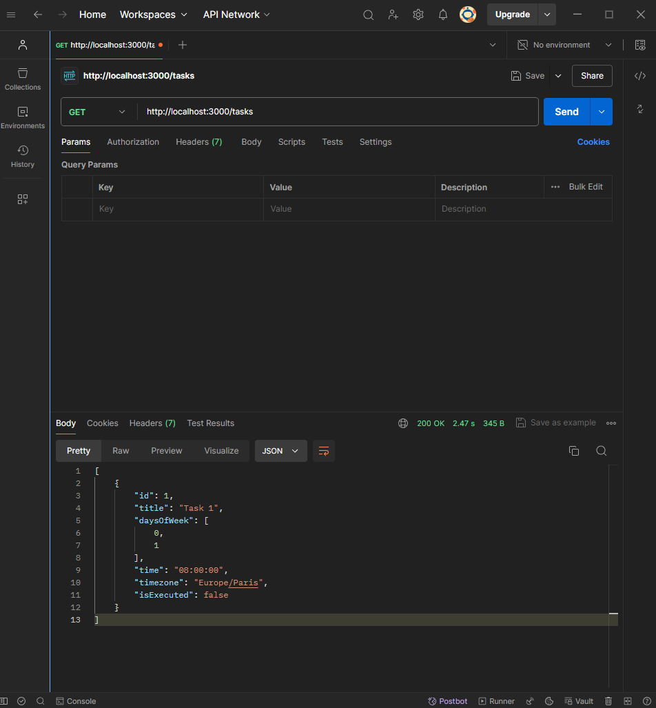

# Cron Service Simulation

Ce projet simule un service CRON en utilisant NestJS, PostgreSQL, Prisma, et Neon. Les tâches enregistrées peuvent être exécutées selon leurs propres critères.

## Prérequis

- Node.js
- PostgreSQL
- Prisma
- NestJS CLI 

## Installation

1. Clonez le dépôt :
   ```bash
   git clone <url-du-depot>
   cd <nom-du-dossier>
    ``` 
2. Installez les dépendances :
    ```bash
    npm install
    ```
3. Configurez les variables d'environnement en créant un fichier .env à la racine du projet et en y ajoutant votre connexion à la base de données :
    ```bash
    DATABASE_URL="postgresql://<username>:<password>@ep-steep-butterfly-a24ou4uo-pooler.eu-central-1.aws.neon.tech:5432/<database_name>?schema=public"
    ``` 
4. Initialisez Prisma :
    ```bash
    npx prisma migrate dev --name init
    npx prisma generate

    ```
5. Démarrez le serveur :
    ```bash
    npm run start:dev
    ```
## ENDPOINTS
- POST /tasks
- GET /tasks
- GET /tasks/:id
- PUT /tasks/:id
- PATCH /tasks/:id/run
- GET /tasks/:id/status
- DELETE /tasks/:id

## API
1 - Créer une tâche
```bash
- URL: http://localhost:3000/tasks
- Méthode: POST
- Headers: Content-Type: application/json
- Body: 
{
  "title": "Task 1",
  "daysOfWeek": [0, 1],
  "time": "08:00:00",
  "timezone": "Europe/Paris"
}
```


2 - Lister les tâches
```bash
- URL: http://localhost:3000/tasks
- Méthode: GET
```


3 - List Tache By Id
```bash
- URL: http://localhost:3000/tasks/:id
- Méthode: GET
```


4 - Modifier une tâche
```bash
- URL: http://localhost:3000/tasks/:id
- Méthode: PUT
- Headers: Content-Type: application/json
- Body: 
{
  "title": "Task 1",
  "daysOfWeek": [0, 4],
  "time": "09:00:00",
  "timezone": "Europe/Paris"
}
```


5 - Lancer une tâche manuellement 
```bash
- URL: http://localhost:3000/tasks/:id/run
- Méthode: PATCH
```


6 - Vérifier le statut d'une tâche
```bash
- URL: http://localhost:3000/tasks/:id/status
- Méthode: GET
```


7 - Supprimer une tâche
```bash
- URL: http://localhost:3000/tasks/:id
- Méthode: DELETE
```


## Table de la base de données
